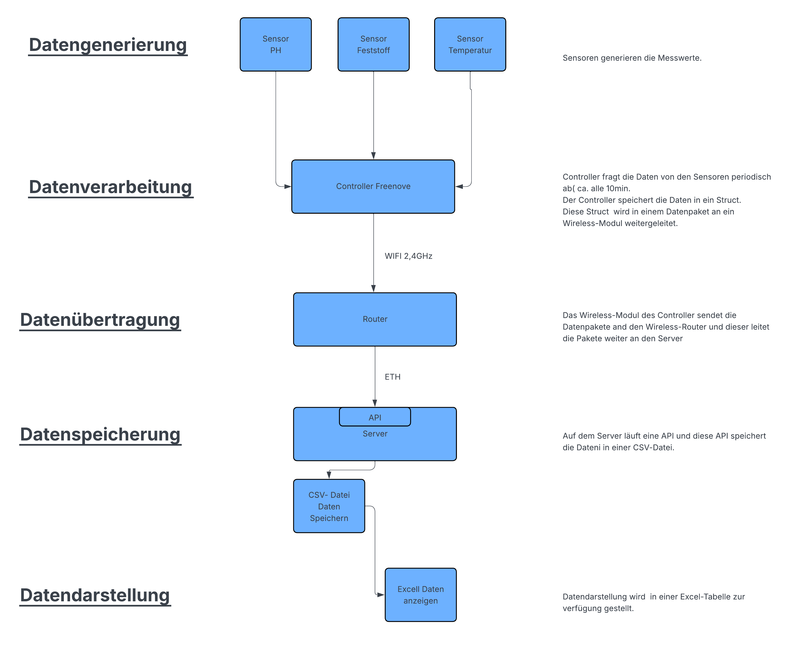
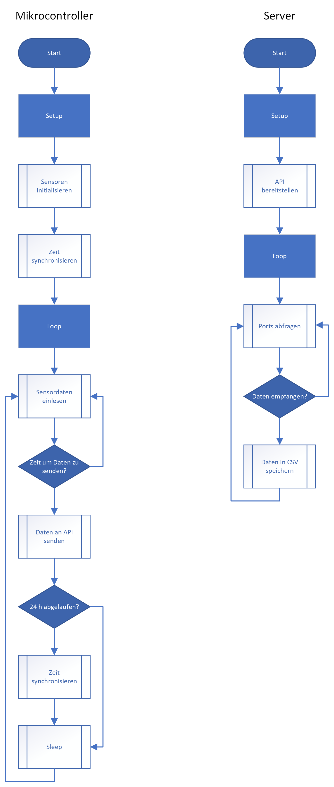

###############################################################
# Koi
Wasser- und Luft-Daten erfassen und auf Server in CSV-Datei speichern

Autoren: Isabel Geissmann(Product-Owner)

Stephan Fankhauser (Tech-Lead)

Peter Meier (Scrum-Master)

Dieses readme.md gilt für beide GitHub Projekt-Repository:

https://github.com/softwareentwicklung-hft/koi_api/tree/test

https://github.com/Latrusanimi/Koi

###############################################################

## Inhaltsverzeichnis

1. [Projektbeschreibung](#projektbeschreibung)
2. [Anforderungen](#anforderungen)
   - [Funktionen](#funktionen)
   - [Hardware-Komponenten](#hardware-komponenten)
   - [Software-Komponenten](#software-komponenten)
3. [Scrum Meetings](#scrum-meetings)
   - [20251115_Sprint1](#20251115_sprint1)
   - [20251122_Sprint1 erreicht](#20251122_sprint1-erreicht)
   - [20251122_Sprint2](#20251122_sprint2)
   - [20251129_Sprint2 erreicht](#20251129_sprint2-erreicht)
   - [20251129_Sprint3](#20251129_sprint3)
   - [20251206_Sprint3 erreicht](#20251206_sprint3-erreicht)
   - [20251206_Sprint4](#20251206_sprint4)
   - [20251213_Sprint4 erreicht](#20251213_sprint4-erreicht)
   - [20251213_Sprint5](#20251213_sprint5)
   - [20251222_Sprint5 erreicht](#20251222_sprint5-erreicht)
   - [20251220_Sprint6](#20251220_sprint6)
   - [20260109_Sprint6 erreicht](#20260109_sprint6-erreicht)
4. [Flussdiagramm](#flussdiagramm)
5. [Ablaufdiagramm](#ablaufdiagramm)
6. [Projekt-Links](#projekt-links)
7. [HTTP Test-Befehle](#http-test-befehle)

---

### Projektbeschreibung
Im Rahmen dieses Projekts wird eine Anlage erstellt,
welche die Wasserqualität des BBT-Teichs mit Sensoren und einem Controller erfasst.  
Diese Daten werden via lokales Netzwerk mit WiFi über eine API an einen Server übertragen,
der sie in einer CSV-Datei speichert.

---

### Anforderungen

#### Funktionen
| Funktion                                 | Muss | Wunsch | erfüllt |
|------------------------------------------|------|--------|---------|
| Daten Wassertemperatur erfassen          | X    | -      | OK      |
| Daten Wasserfeststoff erfassen           | X    | -      | OK      |
| Daten in Controller aufbereiten          | X    | -      | OK      |
| Daten via WiFi und API an Server senden  | X    | -      | OK      |
| Daten auf Server speichern in CSV-Datei  | X    | -      | OK      |
| Daten Luft erfassen (Druck/Temp/Feuchte) | -    | X      | OK      |
| Daten Wasser PH-Wert erfassen            | -    | X      | 1)      |

1) Weil der PH-Sensor nicht erhalten wurde, fehlt diese Wunschfunktion.

#### Hardware-Komponenten
| Hardware-Komponente     | Bezeichnung             | Typ        |
|-------------------------|-------------------------|------------|
| Microcontroller ESP32   | Freenove ESP32-S3-WROOM | FNK0099    |
| Breakoutboard           | Freenove Breakoutboard  | FNK0091    |
| TDS-Sensor              | Seed Studio SKU X       | 101020753  |
| Temperaturfühler        | DS18B20                 | DS18B20    |
| PH-Messfühler           | DFROBOT                 | SEN0161-V2 |
| Messfühler Luftqualität | BME 680                 | BME 680    |

#### Software-Komponenten
| Software-Komponente |
|---------------------|
| CLion               |
| GitHub              |
| MS-Excel            |

---

### Scrum Meetings

#### 20251115_Sprint1
| Sprint-Ziel                  |           
|------------------------------|
| Rollenverteilung             | 
| Projekt-Definition           | 
| Hardware Definition          | 
| Software Definition          | 
| GitHub Repository erstellen  | 

#### 20251122_Sprint1 erreicht
| Sprint-Ziel                  | Erfüllt |          
|------------------------------|---------|
| Rollenverteilung             | OK      |
| Projekt-Definition           | OK      |
| Hardware Definition          | OK      |
| Software Definition          | OK      |
| GitHub Repository erstellen  | OK      |

Rollenverteilung:
- Projekt-Owner: Isabel Geissmann
- Tech Lead: Stephan Fankhauser
- Scrum-Master: Peter Meier

#### 20251122_Sprint2
| Sprint-Ziel                                  |           
|----------------------------------------------|
| Datenflussdiagramm erstellen                 | 
| Ablaufdiagramm Controller & Server erstellen |  

#### 20251129_Sprint2 erreicht
| Sprint-Ziel                                  | Erfüllt |          
|----------------------------------------------|---------|
| Datenflussdiagramm erstellen                 | OK      |
| Ablaufdiagramm Controller & Server erstellen | OK      |

#### 20251129_Sprint3
- Sprint-Ziel: (noch nicht ausgefüllt)

#### 20251206_Sprint3 erreicht
- Sprint-Ziel erreicht

#### 20251206_Sprint4
| Sprint-Ziel                                                                                          |           
|------------------------------------------------------------------------------------------------------|
| CLion-Programm API-Server erstellen/Daten vom Controller als CSV-Datei speichern.                    | 
| CLion Programm, das die Daten im Controller erfasst und über WiFi an den API-Server sendet erstellen | 
| Zusammensetzen der Programmteile und Testen mit der Hardware                                         |  

#### 20251213_Sprint4 erreicht
| Sprint-Ziel                                                                                          | Erfüllt |          
|------------------------------------------------------------------------------------------------------|---------|
| CLion-Programm API-Server erstellen/Daten vom Controller als CSV-Datei speichern.                    | OK      |
| CLion Programm, das die Daten im Controller erfasst und über WiFi an den API-Server sendet erstellen | OK      |
| Zusammensetzen der Programmteile und Testen mit der Hardware                                         | 1)      |

1) Sensoren wurden erst am 12.12.2025 erhalten, deshalb konnte Punkt 3 nicht durchgeführt werden.

#### 20251213_Sprint5
| Sprint-Ziel                                                                                          |           
|------------------------------------------------------------------------------------------------------|
| CLion Programm, das die Daten im Controller erfasst und über WiFi an den API-Server sendet erstellen |   
| Zusammensetzen der Programmteile und Testen mit der Hardware                                         |
| System funktioniert (Hardware und Software)                                                          |
| System im Teich und Lehrerzimmer installiert                                                         |
| Daten über 3 Tage erfasst                                                                            |
| Code auf GitHub gespeichert                                                                          |
| Dokumentation erstellt                                                                               |
| Video erstellt                                                                                       |  
| Test-Dokument erstellt                                                                               |

#### 20251222_Sprint5 erreicht
| Sprint-Ziel                                                                                          | Erfüllt |
|------------------------------------------------------------------------------------------------------|---------|
| CLion Programm, das die Daten im Controller erfasst und über WiFi an den API-Server sendet erstellen | OK      |
| Zusammensetzen der Programmteile und Testen mit der Hardware                                         | OK      |
| System funktioniert (Hardware und Software)                                                          | OK      |
| System im Teich und Lehrerzimmer installiert                                                         | OK      |
| Daten über 3 Tage erfasst                                                                            | 1)      |
| Code auf GitHub gespeichert                                                                          | OK      |
| Dokumentation erstellt                                                                               | OK      |
| Video erstellt                                                                                       | OK      |
| Test-Dokument erstellt                                                                               | OK      |
| Projektdokumentation abgegeben                                                                       | OK      |

1) Erster Tag Datenerfassung Zuhause in Eimer, zweiter Teil im BBZ-Teich; BBZ-WLAN zwischen 23:00 und 06:00 Uhr aus.

#### 20251220_Sprint6
| Sprint-Ziel                                |           
|--------------------------------------------|
| Präsentation Projekt im Januar vorbereiten | 
| Präsentation beendet                       | 

#### 20260109_Sprint6 erreicht
| Sprint-Ziel                                | Erfüllt |          
|--------------------------------------------|---------|
| Präsentation Projekt im Januar vorbereiten |         |
| Präsentation beendet                       |         |

---

### Flussdiagramm

### Ablaufdiagramm

### Projekt-Links
- GitHub Repository 1: [koi_api](https://github.com/softwareentwicklung-hft/koi_api/tree/test)
- GitHub Repository 2: [Koi](https://github.com/Latrusanimi/Koi)
- CSV-Dateien: [waterdata_log.csv](https://github.com/softwareentwicklung-hft/koi_api/blob/test/waterdata_log.csv) 
               [airdata_log.csv](https://github.com/softwareentwicklung-hft/koi_api/blob/test/airdata_log.csv)
- Kanban: [GitHub Projects](https://github.com/users/pesche70/projects/7)
- Videos:
 
### HTTP Test-Befehle

 Luftdaten abrufen

curl -X GET http://<IP-Adresse Server>:18080/koi/air

 Luftdaten speichern

curl -X POST http://<IP-Adresse Server>/koi/air -H "Content-Type: application/json" -d "{\"device_id\": \"SENSOR_01\", \"timestamp\": 1704067200, \"pressure_value\": 1012.5, \"temp_value\": 22.8, \"humidity_value\": 55.7}"

 Wasserdaten speichern

curl -X POST http://<IP-Adresse Server>:18080/koi/water -H "Content-Type: application/json" -d "{\"device_id\": \"SENSOR_02\", \"timestamp\": 1704067200, \"tds_value\": 1012.5, \"temp_value\": 22.8, \"ph_value\": 7}"

 Wasserdaten abrufen

curl -X GET http://<IP-Adresse Server>:18080/koi/water

20251221
